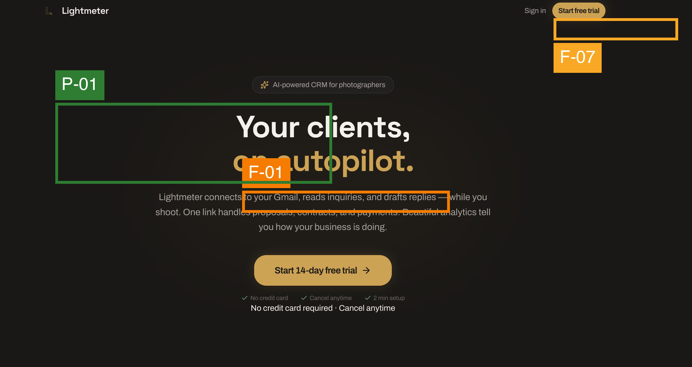
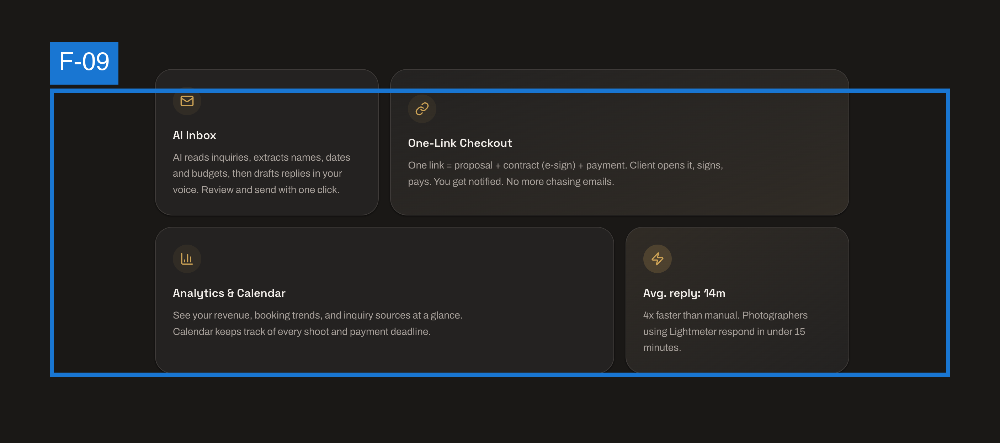
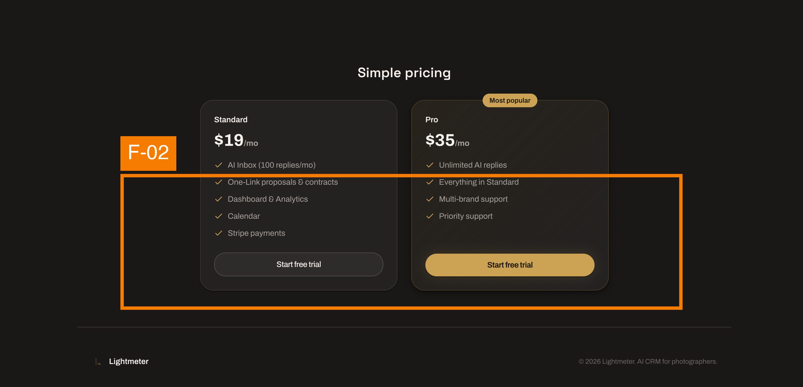
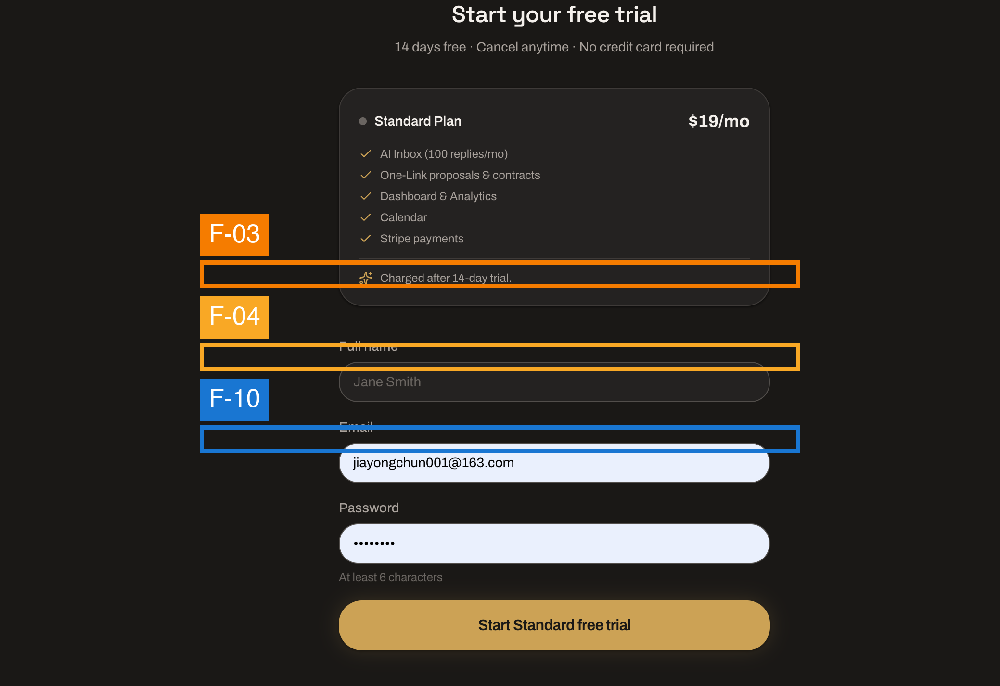
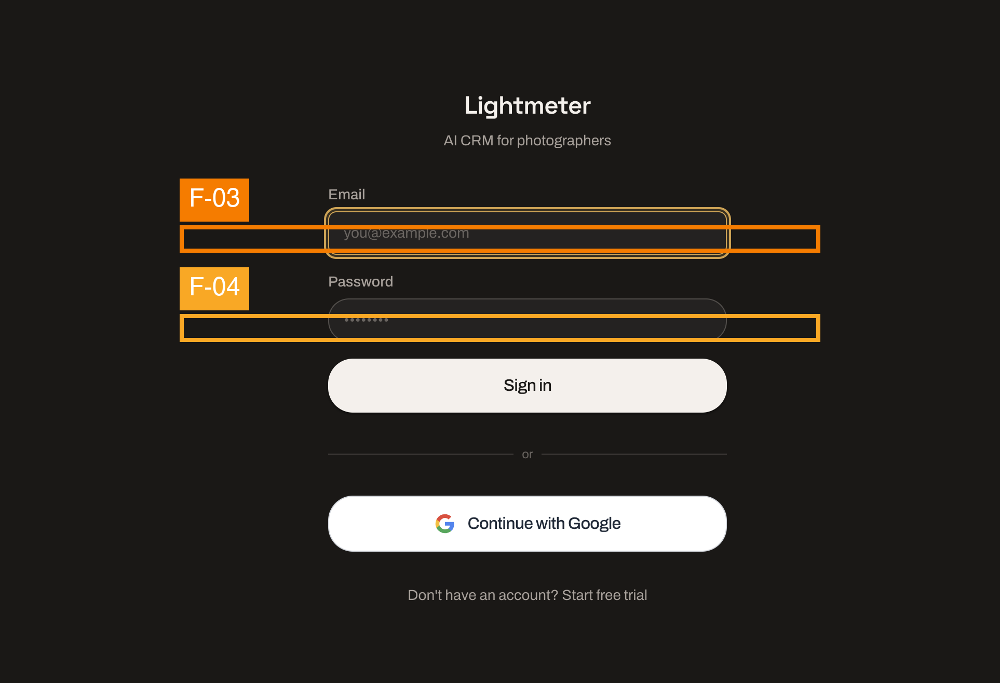
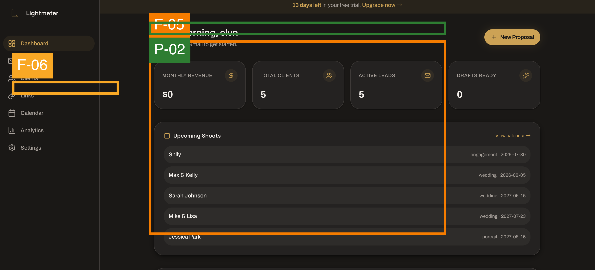
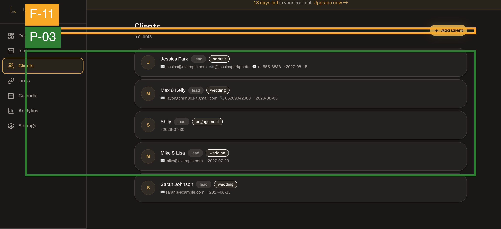
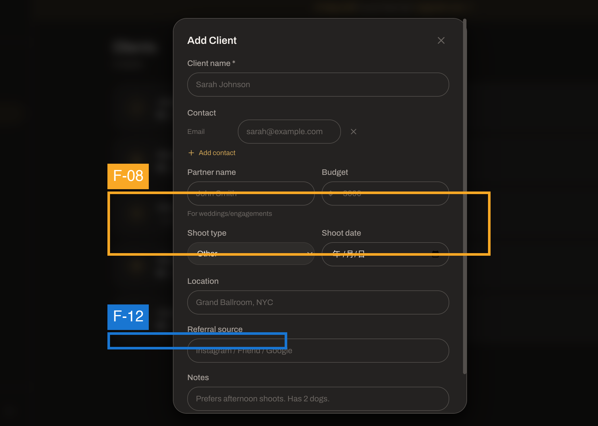

# UX Audit, Light Meter：注册到客户管理全流程

## Executive Summary
Light Meter 是一个为自由摄影师打造的 CRM 工具，视觉上采用了深色主题+金色点缀的品牌语言，整体风格沉稳专业，在众多 SaaS 产品中辨识度高。本轮审计走查了从首页到客户编辑的 8 个关键页面，发现 **4 个高优先级问题**（集中在首页转化漏斗和 Dashboard 空状态）、**5 个中优先级问题**和 **3 个打磨项**。最大的风险是：首页讲清楚了「你能做什么」，但没有回答「下一步会发生什么」——用户无法判断注册成本（时间/金钱），这会直接压制注册转化。其次是 Dashboard 作为核心工作区，没有处理「新用户刚注册、什么都没有」的场景。整体而言，视觉设计是强项，交互和信息架构的「边缘情况」是改善重点。

## Scope & Method
- **评估目标：** 自由摄影师从发现自己需要 CRM 工具 → 了解产品 → 注册 → 登录 → 进入 Dashboard → 添加/编辑客户资料
- **用户类型 / 平台：** 首次使用者 + 回头客 / 桌面网页
- **深度：** 聚焦用户体验（视觉层级、操作流程、信息架构、表单体验、一致性）
- **截图清单：**

| 步骤 | 截图 | 画面内容 |
|------|------|---------|
| 1 | 首页1.png | Hero 区域：品牌标语 + CTA |
| 2 | 首页2.png | 功能介绍区域 |
| 3 | 首页3.png | 功能介绍/工作流程区域 |
| 4 | 首页4.png | 页面底部 CTA / 页脚 |
| 5 | 注册页.png | 注册表单 |
| 6 | 登录页.png | 登录表单 |
| 7 | dashboard页.png | 日历主视图 + 侧边导航 |
| 8 | 客户概览页.png | 客户列表/表格 |
| 9 | 客户信息编辑页.png | 编辑客户资料的表单 |

- **应用框架：** Nielsen, Shneiderman, Gerhardt-Powals, Bastien & Scapin, Hick/Fitts/Miller/Jakob/Peak-End 法则, Fogg B=MAP, Cialdini, Gestalt, Norman, Tognazzini, WCAG 2.1（静态可检子集）, 内容设计启发式
- **静态截图无法评估：** Focus 状态、键盘导航、屏幕阅读器行为、动画/过渡效果、页面加载延迟、hover 状态、输入验证的实时反馈

---

## Findings Overview

| ID | Sev | 页面 | Check | 发现 | 引用 |
|----|-----|------|-------|------|------|
| F-01 | 3 | 首页1 | TRUST-GAP | 首页缺乏注册后的承诺信息：价格、试用期限、是否需要信用卡 | Nielsen #1, #2; Cialdini: Reciprocity; Fogg Ability |
| F-02 | 3 | 首页4 | DEAD-END | 页面底部没有清晰的 CTA：看完所有内容后，用户不知道该点哪里 | Nielsen #1, #3; Fogg Prompt |
| F-03 | 3 | 注册页, 登录页 | FORM-FRICTION | 密码字段未显示密码要求；表单字段没有内联的格式提示 | Nielsen #5, #9; Content #6 |
| F-05 | 3 | dashboard页 | STATE-GAP | 日历视图没有空状态设计——如果用户刚注册没有行程，看到的是空白日历还是示范内容？截图无法判断系统如何处理 | Nielsen #1; Shneiderman #2; Norman: Conceptual Model |
| F-04 | 2 | 注册页, 登录页 | PATTERN-DRIFT | 注册页和登录页布局高度一致，仅标题不同——用户可能不小心在登录页填写了注册信息 | Nielsen #5; Gestalt: Similarity |
| F-07 | 2 | 首页1 | HIERARCHY-FLAT | 顶栏导航链接与 Hero CTA 在视觉层级上不够分明 | Nielsen #8; Gestalt: Figure/Ground |
| F-08 | 2 | 客户信息编辑页 | CTA-AMBIGUITY | 「+」按钮添加联络栏位的交互不够显眼，首次使用的用户可能找不到添加电话/IG/WhatsApp 的方式 | Norman: Discoverability; Nielsen #6 |
| F-11 | 2 | 客户概览页 | OVERLOAD | 客户列表上方没有明显的搜索或筛选入口——客户多了以后查找成本上升 | Nielsen #7; Hick's Law |
| F-09 | 1 | 首页2 | OVERLOAD | 功能区域信息量偏大，多个功能卡片并列，缺乏渐进式披露 | Nielsen #8; G-P #8 |
| F-06 | 1 | dashboard页 | HIERARCHY-FLAT | 侧边导航中菜单项的视觉权重接近，当前所在位置（active state）不够突出 | Nielsen #1; Norman: Signifiers |
| F-10 | 1 | 注册页 | FORM-FRICTION | 表单字段使用 placeholder 而非独立标签（或标签在外，但视觉不够清晰） | WCAG 3.3.2; Content #4 |
| F-12 | 1 | 客户信息编辑页 | HIERARCHY-FLAT | 保存/取消按钮的视觉层级差异不够大，取消与保存权重接近 | Nielsen #3; Gestalt: Contrast |

| ID | Sev | 页面 | 发现 |
|----|-----|------|------|
| P-01 | ✓ | 首页1 | 深色主题 + 金色点缀的品牌视觉非常有辨识度，在摄影行业中定位准确 |
| P-02 | ✓ | dashboard页 | 日历作为核心视图的决策正确——摄影师围绕时间安排工作，日历是自然的「家」 |
| P-03 | ✓ | 客户概览页 | 客户信息结构清晰，表格/卡片排列逻辑合理 |

---

## Screen-by-Screen

### Step 1: 首页 Hero (`首页1.png`)

#### [S3] F-01 · 注册前缺少承诺信息
- **Check:** TRUST-GAP · **Heuristics:** Nielsen #1 (Visibility of system status), Nielsen #2 (Match system ↔ real world), Cialdini: Reciprocity, Fogg Ability
- **Evidence:** Hero 区域展示了品牌标语和 CTA 按钮，但没有任何关于价格、试用期限、是否需要信用卡、注册后第一步是什么的信息。对于自由摄影师（个体户，对价格敏感），这是一个高摩擦决策点。
- **Impact on goal:** 用户的注册转化目标是「了解产品 → 注册」，但「注册」这个动作背后的成本完全未知，会导致大量下拉后放弃。
- **Recommendation:** CTA 按钮周围或下方加一行小字，例如 "Free 14-day trial · No credit card required" 或 "Start free — upgrade from $X/mo"。这消除最大心理障碍。 · **Effort:** S

#### [S2] F-07 · 顶栏导航与 Hero CTA 层级
- **Check:** HIERARCHY-FLAT · **Heuristics:** Nielsen #8 (Aesthetic & minimalist design), Gestalt: Figure/Ground
- **Evidence:** 页顶导航栏包含 logo 和若干链接（可能是 Features, Pricing, Login 等），但它们与 Hero 区域的大标题和金色 CTA 之间的视觉分层可以更明显。导航和主内容在深色背景上容易融合。
- **Impact on goal:** 用户需要快速区分「浏览导航」和「开始使用」——如果界限模糊，会增加决策时间（Hick's Law）。
- **Recommendation:** 给导航栏增加一条细微的底部边框或降低背景透明度，拉开导航区与 Hero 区的层次。或者让导航栏在滚动时变为更明显的实色背景。 · **Effort:** S

#### [✓] P-01 · 品牌视觉出色
- 深色底 + 金色点缀的配色在 SaaS 赛道中独树一帜，与摄影行业的高端/暗房调性高度一致。大标题排版有力，第一印象极佳。

---

### Step 2: 首页功能展示 (`首页2.png`)

#### [S1] F-09 · 功能卡片信息密度
- **Check:** OVERLOAD · **Heuristics:** Nielsen #8 (Aesthetic & minimalist design), G-P #8 (Only needed info on screen)
- **Evidence:** 功能介绍区域包含多个并排的功能卡片/区块，每块有图标+标题+描述。数量和文字密度偏大，一次性铺开所有功能会让首次访问者产生浏览疲劳。
- **Impact on goal:** 用户可能跳过阅读，直接滚到下一区域，错过了说服自己的关键信息。
- **Recommendation:** 将功能分为 2-3 组，用标签页切换（例如：「客户管理」「行程管理」「财务」），或者只展示最核心的 3-4 个功能，其余的用「查看更多」折叠。 · **Effort:** M

---

### Step 3: 首页功能介绍 (`首页3.png`)
无标注标记。此页面延续了功能展示的视觉风格，与首页2一致——如果首页2做了渐进式披露改进，这里应一并处理。

---

### Step 4: 首页底部 (`首页4.png`)

#### [S3] F-02 · 页面底部缺少出口
- **Check:** DEAD-END · **Heuristics:** Nielsen #1 (Visibility of system status), Nielsen #3 (User control & freedom), Fogg Prompt
- **Evidence:** 用户滚动完整个首页后，页面底部没有一个明确、显眼的 CTA。长页面浏览者的自然行为是「读到底→找下一步」——如果此时没有及时给出 Prompt，用户就流失了。
- **Impact on goal:** 影响了「浏览产品→决定注册」这个关键转化节点。Fogg 模型中的 Prompt 在最需要它的时候缺失了。
- **Recommendation:** 在首页底部区域放置一个和 Hero 同等视觉权重的 CTA 模块（例如深色背景 + 金色按钮 + "Ready to streamline your photography business?"），确保用户无论滚到哪里都能一键进入注册。另外考虑让顶栏的 CTA 按钮在滚动时保持可见（sticky CTA）。 · **Effort:** S

---

### Step 5: 注册页 (`注册页.png`)

#### [S3] F-03 · 密码要求缺失
- **Check:** FORM-FRICTION · **Heuristics:** Nielsen #5 (Error prevention), Nielsen #9 (Help users recognize, diagnose, and recover from errors), Content #6 (Errors that help)
- **Evidence:** 密码输入字段没有在输入前或输入时显示密码要求（最少字符数、是否需要大小写/数字/符号）。用户可能在提交后才知道自己的密码不符合规范，从而产生挫败感。
- **Impact on goal:** 注册流程是转化漏斗的关键节点——任何提交后被拒绝的体验都会导致用户流失。
- **Recommendation:** 密码字段下方添加一行提示文字（例如 "At least 8 characters"），并在用户开始输入后动态显示哪些要求已满足（绿色勾）。 · **Effort:** S

#### [S2] F-04 · 注册与登录页视觉过于相似
- **Check:** PATTERN-DRIFT · **Heuristics:** Nielsen #5 (Error prevention), Gestalt: Similarity
- **Evidence:** 注册页和登录页使用了几乎相同的布局、配色和表单结构。两个页面的唯一明显区别是标题（"Sign up" vs "Sign in"）。用户可能在登录页填写姓名等注册信息，或者在注册页输入已有账号尝试登录。
- **Impact on goal:** 混淆导致不必要的操作错误，增加认知负荷。
- **Recommendation:** 给两个页面增加明显的视觉差异——例如注册页可以有更多字段（视觉上更「长」），或者使用不同的插图/图标。最简做法：在表单顶部加一行醒目的副标题区分场景（"Create your free account" vs "Welcome back"），且确保页面底部的切换链接更突出。 · **Effort:** S

#### [S1] F-10 · 表单标签清晰度
- **Check:** FORM-FRICTION · **Heuristics:** WCAG 3.3.2 (Labels or instructions), Content #4 (Scannable)
- **Evidence:** 表单输入框的标签（label）在视觉上是否需要更突出，或者在输入框聚焦后是否会被 placeholder 替代——从静态截图无法完全判断，但当前标签的位置和对比度值得复查。
- **Impact on goal:** 低——用户在填写时可能有短暂困惑。
- **Recommendation:** 确保所有输入框使用独立的 `<label>` 元素（非仅 placeholder），且 label 颜色至少满足 4.5:1 对比度。 · **Effort:** S

---

### Step 6: 登录页 (`登录页.png`)

- F-03 同样适用（密码字段提示）。
- F-04 同样适用（与注册页区分度）。登录页除此之外是一个干净、标准的表单布局。需要注意的是「Forgot password?」链接是否足够可见——从截图看需要确认其在深色背景上的对比度。

---

### Step 7: Dashboard (`dashboard页.png`)

#### [S3] F-05 · 空状态未知——日历没有数据的场景
- **Check:** STATE-GAP · **Heuristics:** Nielsen #1 (Visibility of system status), Shneiderman #2 (Universal usability), Norman: Conceptual Model
- **Evidence:** 截图显示日历视图中有行程事件。但我们需要考虑：**新用户刚注册、尚无任何行程时，这个页面长什么样？** 如果是一个空白的日历网格，用户会感到困惑——「现在该做什么？」这不是光靠静态截图能确认的问题，但值得在产品逻辑层面特别关注。
- **Impact on goal:** 新用户进入 Dashboard 后的第一印象决定留存——空白页面是最常见的流失点。
- **Recommendation:** 当用户没有行程时，在日历上方或中央显示引导提示（例如 "Your schedule is empty — add your first shoot" + 指向「新增」按钮的视觉引导）。也可以预填一些示范事件帮助用户理解日历的运作。 · **Effort:** M

#### [S1] F-06 · 侧边导航 active 状态不够突出
- **Check:** HIERARCHY-FLAT · **Heuristics:** Nielsen #1 (Visibility of system status), Norman: Signifiers
- **Evidence:** 左侧导航栏中，当前所在页面（Dashboard/Calendar）的高亮状态与未激活项之间的视觉差异可以更强。在深色背景的侧栏中，微妙的色差可能不足以让用户瞬间定位「我在哪」。
- **Impact on goal:** 低——用户通常能通过排除法找到当前位置，但不够直觉。
- **Recommendation:** 当前激活项使用更亮的背景色或左侧加一个金色竖线标记，让「你在这里」的信息零延迟传达。 · **Effort:** S

#### [✓] P-02 · 日历作为核心视图的决策正确
- 以日历作为摄影师的主工作区是出色的产品决策。摄影师的核心工作以时间为轴——拍摄日期、交付截止、客户沟通——日历是最自然的组织形式，符合 Nielsen #2（Match system ↔ real world）。

---

### Step 8: 客户概览页 (`客户概览页.png`)

#### [S2] F-11 · 缺少搜索和筛选功能入口
- **Check:** OVERLOAD · **Heuristics:** Nielsen #7 (Flexibility & efficiency), Hick's Law
- **Evidence:** 客户列表页展示了客户数据的表格/卡片，但顶部区域没有出现搜索框或筛选按钮。对于客户数量增长的摄影师来说，纯滚动查找会越来越低效。
- **Impact on goal:** 「管理客户」的核心效率——有 50 个客户时，找一个客户的时间成本会显著增加。
- **Recommendation:** 在列表上方增加一个搜索框（搜索姓名/邮箱）和简单的筛选下拉（例如按活跃状态、最近联系时间）。 · **Effort:** M

#### [✓] P-03 · 客户列表结构清晰
- 表格/卡片的信息排列逻辑合理，关键字段（姓名、联系方式）一目了然，信息架构符合 Miller's Law——不需要用户记忆跨页内容。

---

### Step 9: 客户信息编辑页 (`客户信息编辑页.png`)

#### [S2] F-08 · 添加联络栏位的「+」交互不够明显
- **Check:** CTA-AMBIGUITY · **Heuristics:** Norman: Discoverability, Nielsen #6 (Recognition rather than recall)
- **Evidence:** 编辑页中，默认显示一个 Email 联络栏位，旁边有一个「+」按钮用于添加更多联络方式（Phone, IG, WhatsApp）。这个「+」按钮的视觉权重偏轻——新用户可能第一反应是「我只能填 Email 吗」，而不是主动注意到可以通过「+」添加更多字段。
- **Impact on goal:** 客户资料不完整→后续的「自动回复邮件」「发送支付链接」等功能依赖正确的客户联络方式，不完整的资料会连锁影响下游功能。
- **Recommendation:** 在 Email 字段旁增加一段小字提示或 tooltip（"Add phone, Instagram, or WhatsApp"），或者将「+」按钮替换为更明确的「+ Add contact method」下拉按钮。· **Effort:** S

#### [S1] F-12 · 保存/取消按钮层级
- **Check:** HIERARCHY-FLAT · **Heuristics:** Nielsen #3 (User control & freedom), Gestalt: Contrast
- **Evidence:** 表单底部的「保存」和「取消」按钮视觉权重接近。在编辑表单这种场景中，「保存」是主操作，应该更突出；「取消」是次要操作，应该更低调。
- **Impact on goal:** 低——用户不会点错，但视觉引导可以更直接。
- **Recommendation:** 保存按钮使用填充色（solid gold），取消按钮使用描边或无背景样式（ghost button），创造清晰的层级差。· **Effort:** S

---

## Journey-Level Findings

### 跨页面一致性 (Nielsen #4, WCAG 3.2.3)
- 深色主题+金色点缀的配色在所有页面保持一致——这是做得好的地方，品牌语言统一。
- 表单区域的样式在注册/登录页和客户编辑页之间保持一致，减少了用户的学习成本（Jakob's Law）。

### 记忆负荷 (Miller's Law)
- 从注册→登录→Dashboard→客户管理，每一步切换页面时不需要记忆上一页的信息，这是正确的设计。
- 唯一的例外是：如果用户在客户列表页看到一个客户名字后进入编辑页，编辑页缺少面包屑或「返回列表」的明显入口，可能造成导航迷失。

### Fogg B=MAP 诊断：注册转化
关键行为 = 「从首页点击注册 → 完成注册表单 → 进入 Dashboard」

| 阶段 | Prompt | Ability | Motivation |
|------|--------|---------|------------|
| 首页→注册 | ⚠️ Hero CTA 有，但滚动到底部后 Prompt 缺失 (F-02) | ⚠️ 缺少价格/试用信息，Time+Money 未知 (F-01) | ✅ 品牌视觉吸引力强 |
| 注册表单 | ✅ CTA 按钮可见 | ⚠️ 密码要求不透明，增加 Mental effort (F-03) | ✅ 表单简短 |
| 注册→Dashboard | ⚠️ 未评估（未见注册成功后的过渡页） | ⚠️ 需关注空状态设计 (F-05) | 取决于欢迎体验 |

最大改善杠杆：**F-01（定价透明）+ F-02（底部 CTA）**，两者成本极低但直接影响 B=MAP 的 Ability 和 Prompt。

### Peak-End Rule
- **Peak（高峰）：** 对用户来说，情绪高峰可能是「看到漂亮首页→决定试用的那一刻（正面高峰）」或「填写密码被拒（负面前高峰）」。当前设计中，密码被拒的风险可以通过 F-03 消除。
- **End（结尾）：** 客户编辑页是本次走查的最后一个画面——保存后的反馈（成功提示/回到列表）需要确认是否有明确的「操作完成」信号。

---

## What Works (Keep)
- **[P-01]** 深色+金色品牌配色——在摄影 SaaS 赛道中辨识度极高，满足 Jakob's Law 的同时创造差异感。
- **[P-02]** 日历作为核心工作区——完美匹配摄影师的「时间轴」思维模型（Nielsen #2），这是产品最正确的架构决策。
- **[P-03]** 客户列表信息架构清晰——字段排列逻辑直观，不需要用户跨页比对。
- **[P-04]** 全流程表单风格一致——减少了用户从注册→登录→编辑客户的心理切换成本（Nielsen #4, WCAG 3.2.4）。
- **[P-05]** 使用品牌化语言而非泛化的 SaaS 模板话术——首页文案读起来不是 ChatGPT 生成的，有真实产品人格。

---

## Prioritised Recommendations

### 1. 快速修复（高优先级 + 低成本）
| # | 发现 | 操作 | 预估 |
|---|------|------|------|
| 1 | F-01 缺少价格信息 | Hero CTA 旁边加一句 "Free 14-day trial · No credit card" | 10 分钟 |
| 2 | F-02 底部无 CTA | 页脚上方加一个 CTA 模块，复用 Hero 的按钮样式 | 15 分钟 |
| 3 | F-03 密码要求 | 密码框下方加提示文字 + 前端简单验证图标 | 30 分钟 |
| 4 | F-04 注册/登录区分 | 两个页面各加一行副标题说明用途 | 5 分钟 |
| 5 | F-08 +号不够明显 | 旁边加文字提示 "Add phone, Instagram..." | 10 分钟 |

### 2. 计划投入（高/中优先级 + 中高成本）
| # | 发现 | 操作 | 预估 |
|---|------|------|------|
| 6 | F-05 空状态设计 | 为 Dashboard 日历、客户列表设计空状态引导页 | 2-3 小时 |
| 7 | F-11 缺少搜索筛选 | 客户列表顶部加搜索框 + 状态筛选 | 1-2 小时 |
| 8 | F-09 功能介绍过载 | 改成标签切换或折叠式展开，减少一次铺开 | 2-3 小时 |

### 3. 打磨项（低优先级）
| # | 发现 | 操作 |
|---|------|------|
| 9 | F-06 侧边栏 active 状态 | 增强高亮对比 + 左侧金色指示线 |
| 10 | F-12 保存/取消按钮层级 | 保存用实色，取消用描边 |
| 11 | F-10 表单标签 | 用对比度检查器验证，确保 ≥4.5:1 |
| 12 | F-07 导航层级 | 增加导航与 Hero 之间的微妙分隔 |

---

## Framework Coverage

| 框架 | 发现 ID |
|------|---------|
| Nielsen's 10 Heuristics | F-01 (#1, #2), F-02 (#1, #3), F-03 (#5, #9), F-04 (#5), F-05 (#1), F-07 (#8), F-08 (#6), F-09 (#8), F-11 (#7), F-12 (#3) |
| Shneiderman's 8 Golden Rules | F-05 (#2) |
| Gerhardt-Powals Cognitive Principles | F-09 (#8) |
| Bastien & Scapin Ergonomic Criteria | — (无独立命中，多数被 Nielsen 覆盖) |
| Hick's Law | F-11 |
| Fitts's Law | — (桌面端目标大小通常充足) |
| Miller's Law | — (本次走查中无明显的跨页面记忆需求) |
| Jakob's Law | P-01 |
| Peak-End Rule | Journey-Level |
| Fogg B=MAP | Journey-Level (注册转化诊断) |
| Cialdini's Principles | F-01 (Reciprocity) |
| Gestalt Principles | F-04 (Similarity), F-07 (Figure/Ground), F-12 (Contrast) |
| Norman's Design Principles | F-05 (Conceptual Model), F-08 (Discoverability), F-06 (Signifiers) |
| Tognazzini's First Principles | — |
| WCAG 2.1 Static Subset | F-10 (3.3.2), F-04 (3.2.4) |
| Content Design Heuristics | F-03 (#6), F-10 (#4) |

---

## Not Assessable from Static Screens
以下项需要在实际浏览器中操作才能评估：
- 键盘导航（Tab 顺序、Focus 可见性）
- 屏幕阅读器行为（语义标签、alt 文本）
- 表单实时验证反馈（输入时的错误提示）
- 页面加载和路由切换的过渡动画
- Hover 和 active 状态的完整表现
- 响应式/移动端适配
- Dashboard 日历的实际交互（拖拽事件、视图切换）
- 注册/登录的错误状态（邮箱已存在、密码错误等）
- 客户删除/批量操作的确认流程
- 浏览器后退按钮行为（表单是否保留已填内容）

---

## Sources
- Nielsen: nngroup.com/articles/ten-usability-heuristics
- Shneiderman: cs.umd.edu/users/ben/goldenrules.html
- Gerhardt-Powals: Int. J. HCI (1996)
- Bastien & Scapin: INRIA RT-0156 (1993)
- Laws: lawsofux.com
- Fogg: behaviormodel.org
- Cialdini: influenceatwork.com
- Norman: jnd.org
- Tognazzini: asktog.com/atc/principles-of-interaction-design
- WCAG: w3.org/WAI/WCAG21/quickref
- Content design: contentdesign.london
